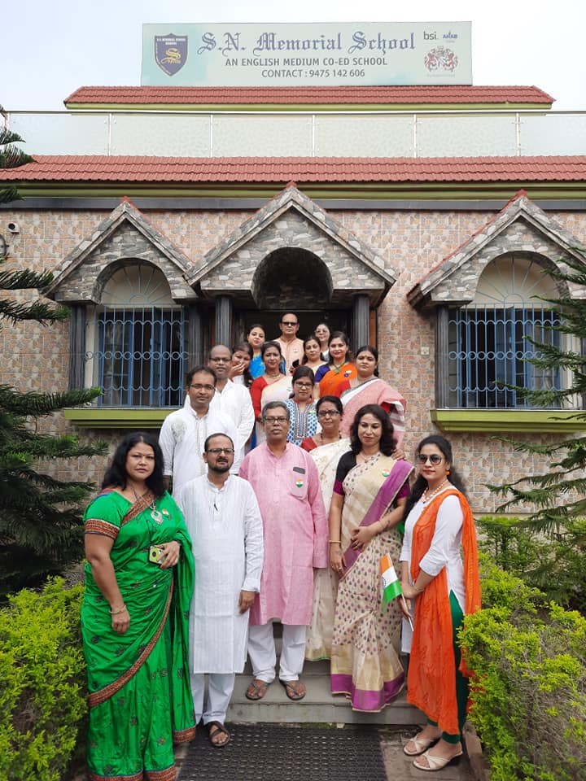

<div align="center">
  
  <h1>S.N. Memorial School</h1>
  <p><strong>Premier CBSE Affiliated English Medium School in Asansol.</strong></p>
  
  [](https://snmemorialschool.pages.dev/)
  [](#)
  [](#)
</div>

<br/>

## 🌟 About The Project

Welcome to the newly redesigned frontend prototype for **S.N. Memorial School**. This platform was crafted with passion and dedication to provide a modern, seamless, and visually stunning digital experience for the school community.

> *"I took the initiative to proudly craft this digital space as a way to give back to our beloved school. I hope you enjoy the new look as much as I enjoyed building it! I have been passionately working on this project since 2024 — from Class VII to today in Class IX."*  
> — **Shasradha Karmakar**

### ⚠️ Development Status
This website is currently under active development and is serving as a **Beta Prototype**. New features and layout refinements are continuously being added!

---

## 🚀 Features

- **Modern Glassmorphism UI:** Stunning visuals powered by custom CSS and Tailwind utilities.
- **Scroll Animations:** Smooth component appearances using *AOS (Animate On Scroll)*.
- **Responsive Navigation:** A seamlessly adaptive navigation bar with mobile menu capabilities.
- **Fast Performance:** Optimized rendering without heavy frameworks. 
- **SEO Ready:** Descriptive semantic HTML and meta tags structured for search engines.

---

## 🛠️ Built With

The project uses a lightweight but modern frontend stack for maximum performance and easiest maintainability:

- **[HTML5](https://developer.mozilla.org/en-US/docs/Web/HTML)** - Core structure
- **[Tailwind CSS](https://tailwindcss.com/)** - Utility-first styling (via CDN)
- **Vanilla JavaScript** - Logic and interactions
- **[Font Awesome](https://fontawesome.com/)** - Beautiful typography-based icons
- **[AOS (Animate On Scroll)](https://michalsnik.github.io/aos/)** - Scroll transition animations
- **[Google Fonts](https://fonts.google.com/)** - Inter & Playfair Display typography

---

## 💻 Running Locally

As a static site, you don't need any complex build tools to run this project! 

1. **Clone the repository:**
   ```bash
   git clone https://github.com/shasradha/SNMS-Redesign.git
   ```
2. **Navigate to the directory:**
   ```bash
   cd SNMS-Redesign
   ```
3. **Open `index.html` in your browser:**
   Double-click the `index.html` file, or use a tool like [Live Server](https://marketplace.visualstudio.com/items?itemName=ritwickdey.LiveServer) in VS Code to get auto-reloading.

---

## 📸 Screenshots

| Home Page | Academics |
| :---: | :---: |
|  |  |

---

## 🤝 Contact

**Developer:** Shasradha Karmakar, Class IX Student  
**School Contact:** [snmemorialasn@gmail.com](mailto:snmemorialasn@gmail.com)  
**Location:** Senraleigh Road, Panchgachia, Asansol - 713341, West Bengal

<br/>
<p align="center">Made with ❤️ for S.N. Memorial School</p>
