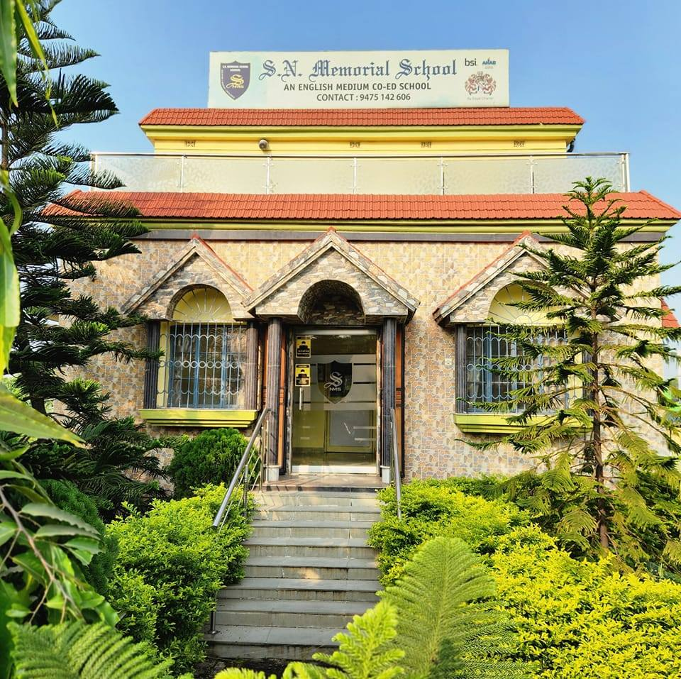
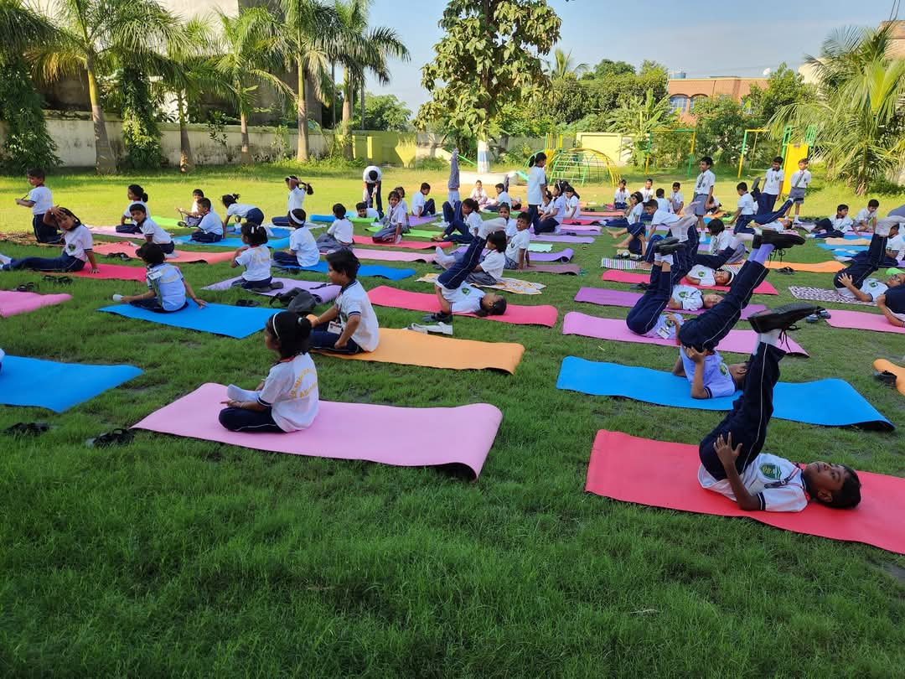
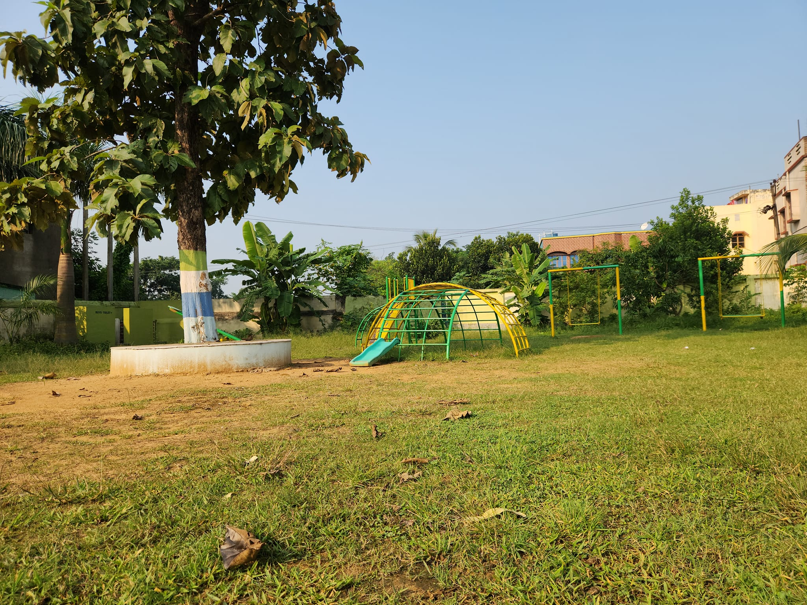

<div align="center">
  
  <br/>
  <h1>S.N. Memorial School 🏫</h1>
  <p><strong>A Modern, Responsive & Premium Digital Experience</strong></p>
  
  [](https://snmemorialschool.pages.dev/)
  [](#)
  [](https://github.com/shasradha)
</div>

---


Welcome to the official frontend redesign prototype for **S.N. Memorial School**, a premier CBSE-affiliated English Medium Co-Educational School located in Asansol, West Bengal. This digital platform was crafted with passion to reflect the school's commitment to excellence and its modern vision.

> *"I took the initiative to proudly craft this digital space as a way to give back to our beloved school. I hope you enjoy the new look as much as I enjoyed building it! I have been passionately working on this project since 2024 — from Class VII to today in Class IX."*  
> — **Shasradha Karmakar**

### ⚠️ Development Status
This repository hosts the **Beta Prototype** of the website. It is currently under active development, bringing iterative UI improvements, enhanced responsiveness, and premium visual elements.

---

## 📸 Campus Showcase

Discover the vibrant life and world-class facilities at S.N. Memorial School.

<div align="center">
  <table>
    <tr>
      <td align="center"><b>Front Campus</b></td>
      <td align="center"><b>Classroom Interior</b></td>
      <td align="center"><b>Science Labs</b></td>
    </tr>
    <tr>
      <td></td>
      <td></td>
      <td></td>
    </tr>
    <tr>
      <td align="center"><b>Computer / Math Class</b></td>
      <td align="center"><b>Annual Function</b></td>
      <td align="center"><b>Dance & Cultural Event</b></td>
    </tr>
    <tr>
      <td></td>
      <td></td>
      <td></td>
    </tr>
  </table>
  <table>
    <tr>
      <td align="center"><b>Yoga Session</b></td>
      <td align="center"><b>Main Playground</b></td>
    </tr>
    <tr>
      <td></td>
      <td></td>
    </tr>
  </table>
</div>

---

## ⚡ Core Features

- **🎨 Modern Glassmorphism UI:** Stunning visuals, blurs, and premium aesthetics powered by custom CSS and Tailwind utilities.
- **✨ Scroll Animations:** Bringing the website to life with smooth, professional scroll transitions using AOS.
- **📱 True Responsiveness:** A flawless experience across desktops, tablets, and smartphones.
- **⚡ Blazing Fast Performance:** Lightweight and optimized rendering without the overhead of heavy SPA frameworks.
- **🔍 SEO Optimized:** Structured with semantic HTML5 tags and meta descriptions to rank high on search engines.

---

## 🛠️ Technology Stack

The project relies on a highly performant and modern frontend architecture:

| Technology | Description |
| :--- | :--- |
| **[HTML5](https://developer.mozilla.org/en-US/docs/Web/HTML)** | Core structural foundation of the pages. |
| **[Tailwind CSS](https://tailwindcss.com/)** | Rapid, utility-first styling for complex and responsive layouts. |
| **Vanilla JavaScript** | DOM manipulation, logic, and interactive components. |
| **[Font Awesome 6](https://fontawesome.com/)** | Extensive, high-quality vector icons for elegant UI accents. |
| **[AOS.js](https://michalsnik.github.io/aos/)** | Specialized library for smooth Animate-On-Scroll behaviors. |
| **[Google Fonts](https://fonts.google.com/)** | Custom typography featuring *Inter* and *Playfair Display*. |

---

## 🚀 Running Locally

Experiencing the project on your local machine is extremely simple. No complicated build processes or configurations required.

1. **Clone the repository:**
   ```bash
   git clone https://github.com/shasradha/snmemorialschool.git
   ```
2. **Navigate to the project directory:**
   ```bash
   cd snmemorialschool
   ```
3. **Launch the site:**
   Simply double-click on `index.html` to open it in your default web browser, or use a tool like [Live Server](https://marketplace.visualstudio.com/items?itemName=ritwickdey.LiveServer) in VS Code for live reloading updates as you code.

---

## 📞 Get In Touch

**Developer:**  
👨‍💻 Shasradha Karmakar (Class IX Student)  
🔗 [GitHub Profile](https://github.com/shasradha)

**School Details:**  
🏫 **Name:** S.N. Memorial School  
📍 **Location:** Senraleigh Road, Panchgachia, Asansol - 713341, West Bengal  
📧 **Email:** [snmemorialasn@gmail.com](mailto:snmemorialasn@gmail.com)  

<br/>
<div align="center">
  
</div>
