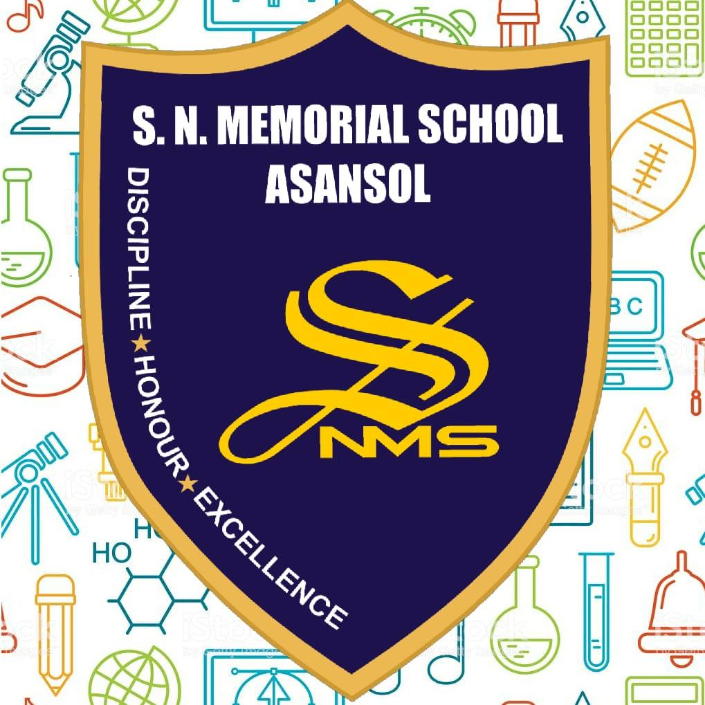
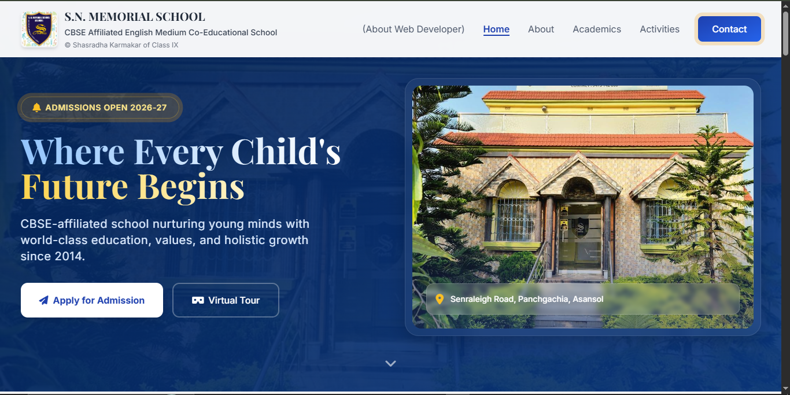
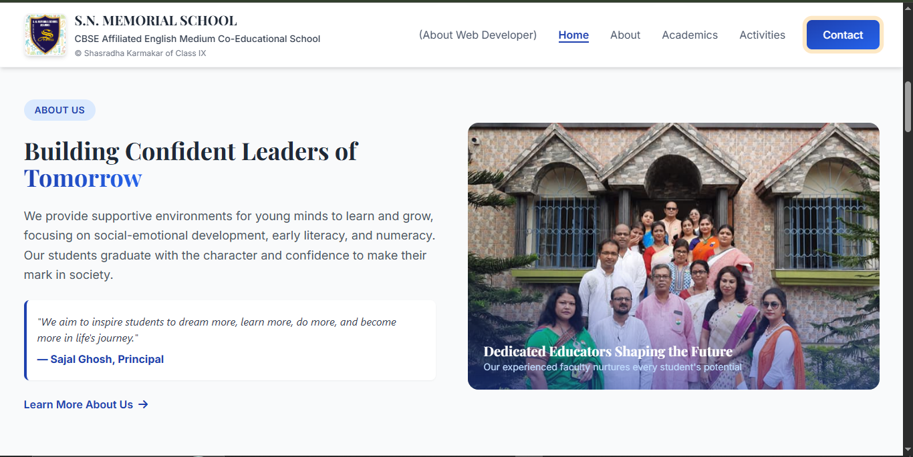
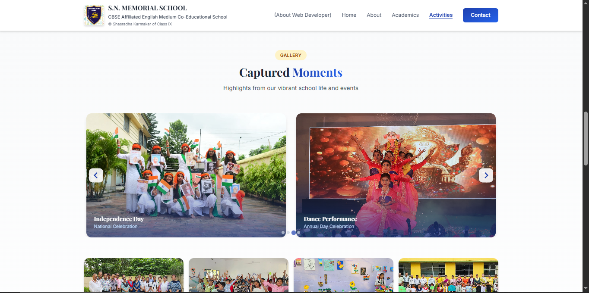
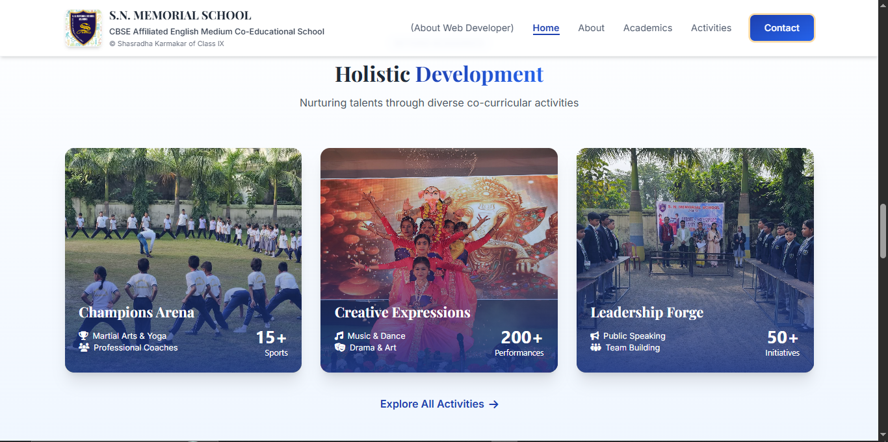
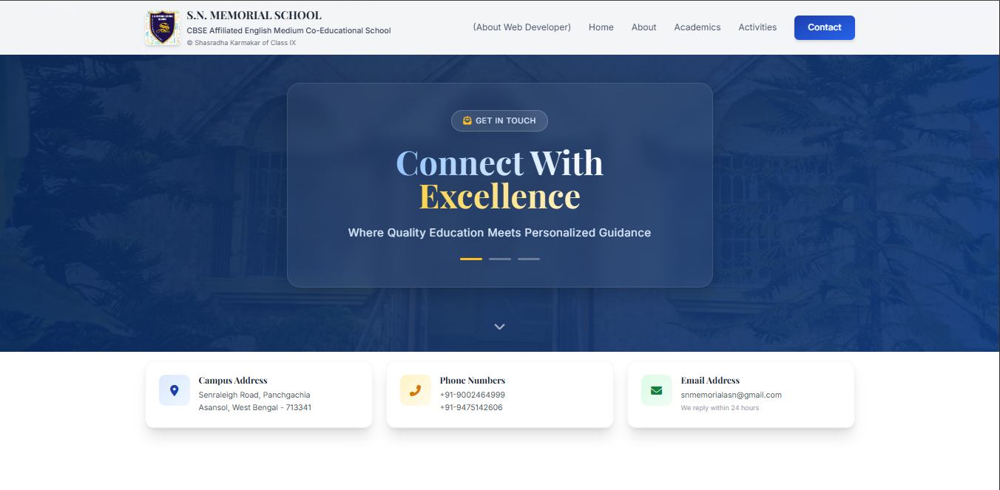
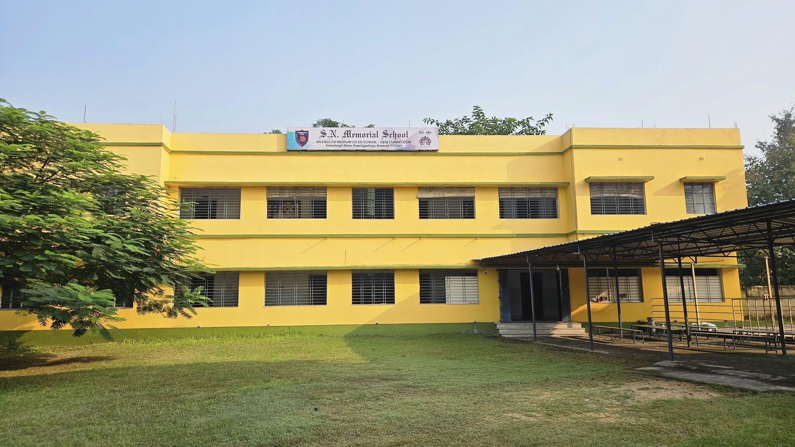
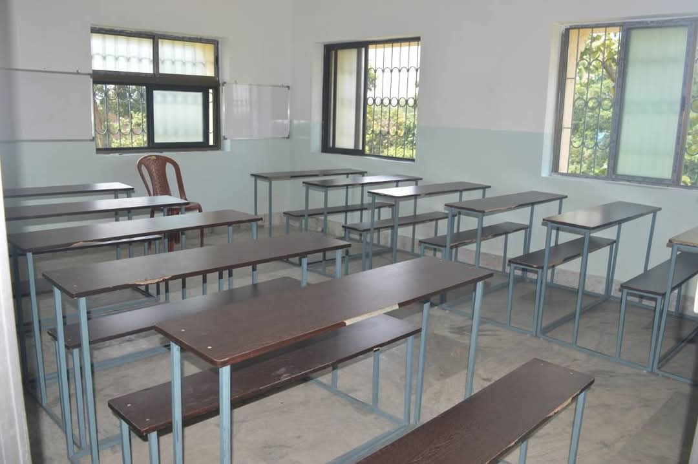
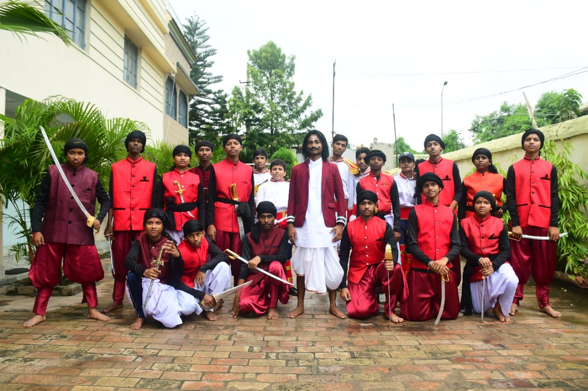

<div align="center">
  
  <br/>
  <h1>S.N. Memorial School 🏫</h1>
  <p><strong>A Modern, Responsive & Premium Digital Experience</strong></p>
  
  [](https://snmemorialschool.pages.dev/)
  [](#)
  [](https://github.com/shasradha)
</div>

---

## 🖥️ Platform Overview

Experience the sleek, modern interface of the new S.N. Memorial School digital platform.

<div align="center">
  
  
  <table>
    <tr>
      <td align="center"><b>About Section</b></td>
      <td align="center"><b>Academics & Features</b></td>
    </tr>
    <tr>
      <td></td>
      <td></td>
    </tr>
    <tr>
      <td align="center"><b>Activities & Gallery</b></td>
      <td align="center"><b>Contact & Footer</b></td>
    </tr>
    <tr>
      <td></td>
      <td></td>
    </tr>
  </table>
</div>

---

## 🏫 About The Project

Welcome to the official frontend redesign prototype for **S.N. Memorial School**, a premier CBSE-affiliated English Medium Co-Educational School located in Asansol, West Bengal. 

> *"I took the initiative to proudly craft this digital space as a way to give back to our beloved school. I hope you enjoy the new look as much as I enjoyed building it! I have been passionately working on this project since 2024 — from Class VII to today in Class IX."*  
> — **Shasradha Karmakar**

### ⚠️ Development Status
This repository hosts the **Beta Prototype** of the website. It is currently under active development, bringing iterative UI improvements and premium visual elements.

---

## 📸 Campus Life

<div align="center">
  <table>
    <tr>
      <td align="center"><b>Campus Building</b></td>
      <td align="center"><b>Classroom Interior</b></td>
    </tr>
    <tr>
      <td></td>
      <td></td>
    </tr>
    <tr>
      <td align="center"><b>Science Labs</b></td>
      <td align="center"><b>Annual Function</b></td>
    </tr>
    <tr>
      <td></td>
      <td></td>
    </tr>
  </table>
</div>

---

## ⚡ Core Features

- **🎨 Modern Glassmorphism UI:** Stunning visuals, blurs, and premium aesthetics.
- **✨ Scroll Animations:** Smooth transitions using AOS.
- **📱 Fully Responsive:** Optimized for all devices.
- **⚡ Performance First:** Lightweight Vanilla JS/Tailwind architecture.
- **🔍 SEO Ready:** Semantic HTML5 structure.

---

## 🛠️ Technology Stack

| Technology | Description |
| :--- | :--- |
| **HTML5 / CSS3** | Core structure and custom glassmorphism styles. |
| **Tailwind CSS** | Premium utility-first layout engine. |
| **Vanilla JS** | Interactive logic and navigation. |
| **Font Awesome 6** | Modern vector icon system. |
| **AOS.js** | Advanced scroll-trigger animations. |

---

## 🚀 Installation & Setup

1. **Clone the repository:**
   ```bash
   git clone https://github.com/shasradha/snmemorialschool.git
   ```
2. **Navigate & Launch:**
   Open `index.html` in any modern web browser or use VS Code's **Live Server**.

---

## 📞 Contact Details

**Developer:** [Shasradha Karmakar](https://github.com/shasradha) (Class IX Student)  
🏫 **School:** S.N. Memorial School, Asansol  
📧 **Email:** [snmemorialasn@gmail.com](mailto:snmemorialasn@gmail.com)  

<br/>
<div align="center">
  
</div>
